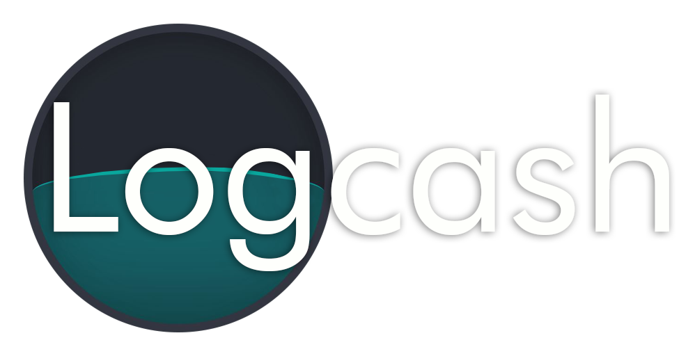

<h1 align="left" style="outline: none; border: none; padding: 0; margin: 0">
	
</h1>

<h2 style="outline: none; border: none; padding: 0; margin: 6px 0">About Logcash</h2>

Logcash is a browser extension which can help you plan and adjust your daily logtime. It will give you an estimation of how many hour you have to do to reach your goal.

<h2 style="outline: none; border: none; padding: 0; margin: 6px 0">Download</h2>
