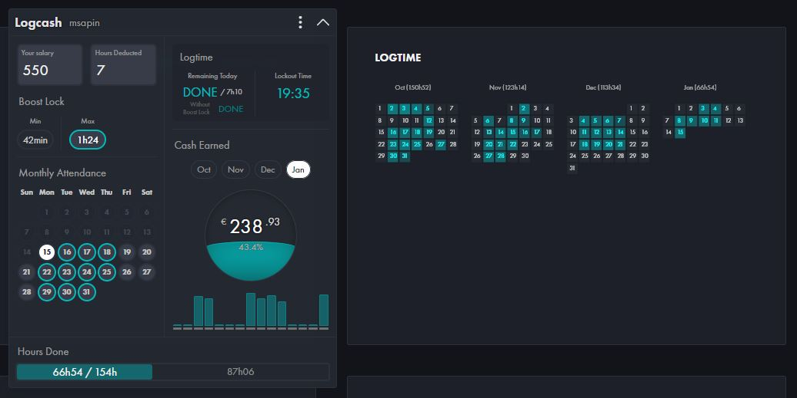
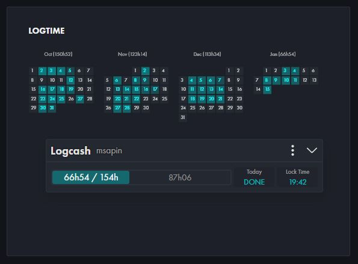

<h1 align="left" style="outline: none; border: none; padding: 0; margin: 0">
    
</h1>

<h2 style="outline: none; border: none; padding: 0; margin: 6px 0">About Logcash</h2>

    Logcash is a browser extension that helps you plan and adjust your daily logtime. It provides an estimate of how many hours you have to do in order to reach your goal.

<h2 style="outline: none; border: none; padding: 0; margin: 30px 0 6px 0">Download</h2>

<h2 style="outline: none; border: none; padding: 0; margin: 30px 0 6px 0">Features</h2>

    
- Real-time updates to keep an eye on your schedule.

    
- Movable and shrinkable panel (white arrow or double click on top) for a minimalist look.

    
- Change the language or panel size in the settings panel (top-right dots).

    
- The extension saves some data in the browser (using local storage) like your Salary, Hours deducted, Monthly attendance, Panel size, Language, Position of the panel... for future use. You can reset all of it using the RESET button in the settings panel (top-right).

<h2 style="outline: none; border: none; padding: 0; margin: 30px 0 20px 0">Screenshots</h2>

    

    - Logtime done for the day -

    

    - Logtime minimized -

